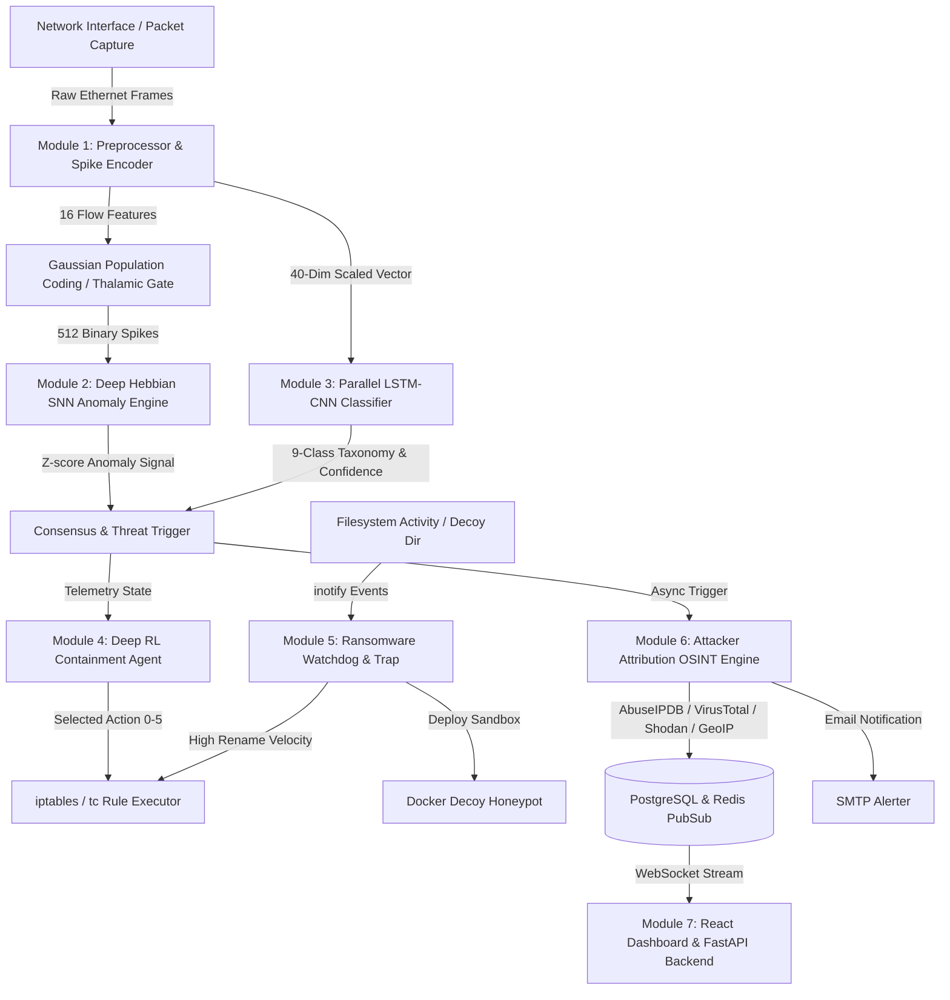

# CortiX: System Architecture & Technical Specifications

---

## 📌 Executive Summary & System Objectives

**CortiX** is a low-latency, neuro-inspired adaptive firewall and intrusion detection system (IDS/IPS) designed to detect zero-day cyber threats, insider attacks, ransomware campaigns, and automated network intrusions in real-time.

Standard signature-based firewalls fail to detect unknown zero-day exploits, while traditional supervised deep learning models require periodic offline retraining and struggle with rapid online adaptation. CortiX bridges this gap by combining **unsupervised biological spiking neural networks (SNNs)** with **supervised deep learning models** and **reinforcement learning automated response systems**.

### Primary Objectives

1. **Zero-Day Anomaly Detection**: Detect novel network anomaly signatures in real-time without requiring labeled training samples using online unsupervised Hebbian learning and Spike-Timing-Dependent Plasticity (STDP).
2. **Sub-10ms Hot-Path Processing**: Process live network packet flows with median latency (p50) $\le 9\text{ ms}$, ensuring zero impact on standard throughput.
3. **Low False Positive Rate**: Maintain a False Positive Rate (FPR) $\le 0.3\%$ using multi-module ensemble voting and median absolute deviation (MAD) statistical baselining.
4. **Autonomous Threat Containment**: Mitigate active threats continuously via a Double-Dueling Deep Q-Network (DQN) agent capable of selecting precise micro-actions (Rate Limiting, VLAN Quarantine, Honeypot Redirection, ACL Blocking).
5. **Active Ransomware Trap**: Neutralize rapid filesystem encryption attacks through automated `inotify` watchers and Docker decoy sandbox containment.
6. **Automated Attacker Attribution**: Enrich threat alerts asynchronously with OSINT intelligence (AbuseIPDB, VirusTotal, Shodan, GeoIP, RDNS) without blocking the hot-path network pipeline.

---

## 🧠 System Architecture Overview

CortiX follows a modular, pub/sub-driven micro-architecture divided into **7 core modules**, orchestrated by a central daemon (`cortix.main.CortixDaemon`) and synchronized via **Redis Pub/Sub** and **PostgreSQL**.



---

## 🧩 Detailed Module Specifications

### Module 1: Packet Preprocessor & Spike Encoder
- **Responsibility**: Ingest raw network frames via Scapy, aggregate packets into flow records, extract feature vectors, and convert numerical values into sparse binary spike arrays.
- **Components**:
  - `PacketCapture`: Asynchronous `pcap`/Scapy wrapper capturing packets from target interface (e.g. `eth0`).
  - `FlowAggregator`: Computes bidirectional 5-tuple metrics over a rolling sliding window ($1.0\text{ s}$ default). Features include packet count, byte volume, payload statistics, inter-arrival time mean/std, TCP flag counts (SYN, ACK, FIN, RST).
  - `SpikeEncoder`: Converts 16 continuous numerical features into a 512-dimensional binary spike vector ($\mathbf{s} \in \{0, 1\}^{512}$) using **Gaussian Population Coding**.
- **Thalamic Sensory Gating**: Filters out low-amplitude noise ($\epsilon < 10^{-4}$) and applies top-$K$ receptive field selection to maintain strict biological sparsity (~10% active spikes).

---

### Module 2: Deep Hebbian SNN Anomaly Engine
- **Responsibility**: Online, continuous, unsupervised anomaly detection using spiking neural networks that adapt dynamically without offline retraining.
- **Architecture**:
  - **Ensemble Composition**: $M = 5$ independent `HebbianModule` instances. Each module consists of $512$ input neurons and $256$ hidden excitatory neurons ($512 \to 256$).
  - **Independent Random Seeding**: Each module is initialized with decorrelated seed sequences to prevent activation collapse and ensure independent functional specialization.
  - **STDP Learning Rule**: Spike-Timing Dependent Plasticity updates synaptic weights $W_{ij}$ based on sub-millisecond pre- and post-synaptic spike arrival times:
    $$\Delta W_{ij} = \begin{cases} A_+ e^{-\Delta t / \tau_+} & \text{if } \Delta t > 0 \text{ (LTP)} \\ -A_- e^{\Delta t / \tau_-} & \text{if } \Delta t < 0 \text{ (LTD)} \end{cases}$$
  - **Oja's Normalization**: Prevents runaway synaptic saturation by constraining weight norm:
    $$\Delta W = \eta \left( y \mathbf{x}^T - y^2 W \right)$$
  - **$k$-Winner-Take-All ($k$-WTA)**: Enforces 10% lateral inhibition sparsity ($k = 25$ active hidden neurons out of 250+).
  - **Reconstruction Anomaly Scorer**: Measures novelty via synaptic reconstruction error:
    $$\text{Error} = \|\mathbf{x} - W^T \mathbf{y}_w\|^2$$
    Anomalies generate high reconstruction error due to unfamiliar input spike patterns.
  - **MAD-Based Z-Scoring**: Uses Median Absolute Deviation (MAD) over a rolling window ($N = 1000$) to calculate robust $Z$-scores resilient to outlier skewing:
    $$Z = \frac{x - \text{median}}{\text{MAD} \times 1.4826}$$
  - **Metaplasticity & Synaptic Consolidation**: Dynamically adjusts learning rates ($\eta$) based on recent network novelty and periodically prunes weak connections while restoring core memory weights every 10 minutes.

---

### Module 3: LSTM-CNN Supervised Classifier
- **Responsibility**: Provides fine-grained multi-class taxonomy attribution for known attack vectors to calibrate SNN anomaly output.
- **Architecture**:
  - **Model**: `CortixLSTMCNN` (Hybrid 1D-CNN + Bidirectional LSTM + Self-Attention Head).
  - **Input**: Sequence of $T = 10$ historical flows, each formatted as a 40-dimensional feature vector.
  - **Outputs**: 9-class probability distribution:
    1. `BENIGN`
    2. `DoS`
    3. `DDoS`
    4. `PortScan`
    5. `BruteForce`
    6. `WebAttack`
    7. `Infiltration`
    8. `Botnet`
    9. `ZeroDay`
  - **Training Dataset**: Pre-trained on merged CICIDS2017 flow data with standard feature scaling.

---

### Module 4: Deep RL Containment Agent
- **Responsibility**: Autonomous firewall action selection to balance security mitigation against network availability loss.
- **Architecture**:
  - **Model**: Double-Dueling Deep Q-Network (DQN) trained in a Gymnasium environment (`CortixContainmentEnv`).
  - **State Vector (20 Dimensions)**: Combines SNN Z-score, LSTM confidence, one-hot attack class, rolling FPR, IP reputation score, flow volume percentile, and time since last alert.
  - **Action Space (6 Discrete Actions)**:
    - `0: ALLOW` — Unrestricted passage
    - `1: RATE_LIMIT` — Apply `tc` queueing discipline ($1\text{ Mbps}$ cap)
    - `2: TEMP_BLOCK` — Temporary `iptables` drop ($300\text{ s}$)
    - `3: QUARANTINE` — Re-route host to isolated VLAN
    - `4: HARD_BLOCK` — Permanent `iptables` DROP rule
    - `5: HONEYPOT_REDIRECT` — Forward traffic to Docker honeypot sandbox
  - **Reward Function**:
    $$R = +10 \times \text{True Block} - 20 \times \text{False Positive} + 15 \times \text{Honeypot Capture} - 2 \times \text{Unnecessary Action}$$

---

### Module 5: Ransomware Honeypot & File Watchdog
- **Responsibility**: Real-time detection and containment of rapid filesystem encryption or exfiltration attacks.
- **Components**:
  - `HoneypotWatcher`: Uses `inotify` file system monitoring over honeypot decoy directories (`/lab/decoy_files/`).
  - `RansomwareDetector`: Monitors rename and modification velocity ($>10 \text{ renames/sec}$ threshold).
  - `HoneypotTrapManager`: Instantly spawns an isolated Docker honeypot container and instructs `ContainmentExecutor` to re-route attacker traffic to the decoy container via `iptables NAT`.

---

### Module 6: Attacker Attribution OSINT Engine
- **Responsibility**: Asynchronous passive intelligence lookup for flagged threat IPs.
- **Integrations**:
  - **AbuseIPDB**: Retrieves historical abuse report confidence scores.
  - **VirusTotal**: Checks IP against multi-scanner malware domain databases.
  - **Shodan**: Queries open port profiles and service banners.
  - **GeoIP & Reverse DNS**: Resolves country, city, latitude/longitude, ISP, and hostname.
  - **SMTP Alerter**: Dispatches formatted HTML threat alerts directly to administrators when high-severity threats ($Z > 5.0$ or critical class) emerge.

---

### Module 7: React Dashboard & FastAPI Backend
- **Responsibility**: User interface and management control plane.
- **Backend (`cortix.api.main`)**: FastAPI server handling REST endpoints for threat history, manual action overrides, SNN brain telemetry, and a live **WebSocket pub/sub bridge** connected to Redis.
- **Frontend (`cortix-dashboard`)**: Modern React + Vite application featuring:
  - Live threat alert stream with WebSocket auto-reconnect.
  - SNN brain performance graphs (Z-score distributions, weight matrices, latency stats).
  - Interactive rule override controls (Manual Block/Unblock).
  - GeoIP threat map and OSINT profiling cards.

---

## ⚡ Hot-Path Dataflow & Latency Design

To maintain sub-10ms processing latency, CortiX separates the execution path into **Synchronous Hot-Path** and **Asynchronous Cold-Path**:

```
[ Incoming Packet ]
       │
       ▼ (Hot-Path: ~3-7ms)
1. Packet Capture & Flow Aggregation
2. Spike Encoding (Gaussian Population)
3. SNN Anomaly Scoring (Inference only)
4. LSTM-CNN Sequence Classifier
5. DQN Action Selection
6. Rule Execution (iptables/tc)
       │
       ▼ (Cold-Path: Asynchronous Background Threads)
7. Redis Pub/Sub Event Broadcast
8. PostgreSQL Event & Threat Logging
9. Async OSINT API Lookups (AbuseIPDB/Shodan)
10. WebSocket Push to React Dashboard
11. Email Alert Dispatch (SMTP)
```

---

## 🗄️ Infrastructure & Storage Architecture

| Service | Component | Purpose |
|:---|:---|:---|
| **Redis** | In-Memory Message Bus | Pub/Sub event broadcasting (`live_events`, `threat_detected`) across daemon, API, and WebSocket channels. |
| **PostgreSQL / SQLite** | Relational Database | Persistent store for `Threat`, `AttackerProfile`, and `ContainmentAction` records (`cortix.db`). |
| **Docker & Docker Compose** | Container Sandbox | Isolated environment hosting the microservices and ransomware honeypot traps. |
| **iptables & tc** | Linux Kernel Enforcer | Hardware-level packet dropping, NAT honeypot redirection, and bandwidth rate limiting. |

---

## 📊 System Acceptance Criteria

| Metric | Target Requirement | Architectural Implementation |
|:---|:---|:---|
| **Hot-path p50 Latency** | $\le 9\text{ ms}$ | Vectorized NumPy/PyTorch inference, async decoupled OSINT/DB logging |
| **False Positive Rate (FPR)** | $\le 0.3\%$ | 5-module SNN ensemble majority voting + MAD z-score baseline |
| **Detection Rate (Recall)** | $\ge 70\%$ | Hybrid SNN unsupervised novelty + LSTM-CNN sequence classification |
| **F1 Score** | $\ge 0.70$ | Calibrated reward shaping in Double-Dueling DQN containment |
